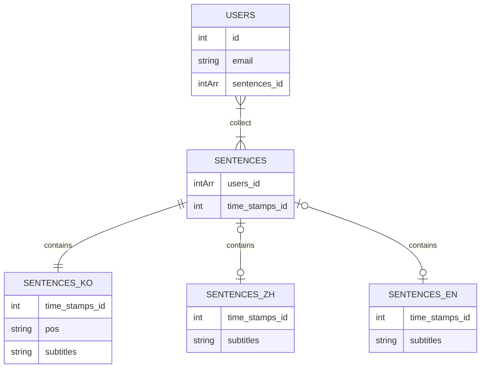

<p align="center">
  <a href="http://nestjs.com/" target="blank"></a>
</p>

<a name="readme-top"></a>

<details>
  <summary>📔 Table of Contents</summary>
- [1. 👉 About the porject](#1--about-the-porject)
  - [1.1. Built with](#11-built-with)
- [2. 👉 Getting Started](#2--getting-started)
  - [2.1. Prerequisites](#21-prerequisites)
  - [2.2. Running the app](#22-running-the-app)
  - [2.3. Test](#23-test)
- [3. 👉 Usage](#3--usage)
- [4. 👉 Roadmap](#4--roadmap)
- [5. 👉 Acknowledgments](#5--acknowledgments)
  - [5.1. MySQL Notes](#51-mysql-notes)
    - [5.1.1. Commands in common](#511-commands-in-common)
    - [5.1.2. Tables](#512-tables)
    - [5.1.3. Entity Relationship Diagrams](#513-entity-relationship-diagrams)
</details>

<!-- ABOUT THE PROJECT -->

# 1. 👉 About the porject

## 1.1. Built with

[Nest](https://github.com/nestjs/nest) framework TypeScript starter repository.

<p align="right">(<a href="#user-content-readme-top">back to top</a>)</p>

# 2. 👉 Getting Started

## 2.1. Prerequisites

```bash
$ npm install
```

## 2.2. Running the app

```bash
# development
$ npm run start
# watch mode
$ npm run start:dev
# production mode
$ npm run start:prod
```

## 2.3. Test

```bash
# unit tests
$ npm run test
# e2e tests
$ npm run test:e2e
# test coverage
$ npm run test:cov
```

# 3. 👉 Usage

<p align="right">(<a href="#user-content-readme-top">back to top</a>)</p>

# 4. 👉 Roadmap

- [ ] Config
  - [ ] Refactor outside app module: [ref](https://stackoverflow.com/questions/69844941/can-i-use-nestjs-config-service-outside-a-module)
- [ ] ORM module
  - [x] init with config module / env
  - [ ] Refactor outsdie app module: [ref](https://docs.nestjs.com/techniques/database#async-configuration)
- [ ] User module
  - [ ] Controller unit test
  - [ ] Hash password
  - [ ] No duplicate user / email
  - [ ] Auth strategy
- [ ] Sentence module

<p align="right">(<a href="#user-content-readme-top">back to top</a>)</p>

# 5. 👉 Acknowledgments

## 5.1. MySQL Notes

### 5.1.1. Commands in common

```bash
$ mysql.server start
$ mysql -u root -p

mysql> SHOW DATABASES;
mysql> SHOW GLOBAL VARIABLES LIKE 'PORT';

mysql> CREATE DATABASE `korean_learner`;
mysql> use `kroean_learner`;
mysql> DESC koPos;
```

### 5.1.2. Tables

```sql
CREATE TABLE IF NOT EXISTS `users` (
  `id` int(11) unsigned NOT NULL auto_increment,
  `username` varchar(50) NOT NULL,
  `hash` BINARY(32) NOT NULL,
  `isActive` BOOLEAN,
  PRIMARY KEY(`id`)
);

CREATE TABLE IF NOT EXISTS `koPos` (
  `id` int(11) unsigned NOT NULL auto_increment,
  `pos` nvarchar(400) NOT NULL,
  PRIMARY KEY(`id`)
);
```

### 5.1.3. Entity Relationship Diagrams


<p align="right">(<a href="#user-content-readme-top">back to top</a>)</p>
